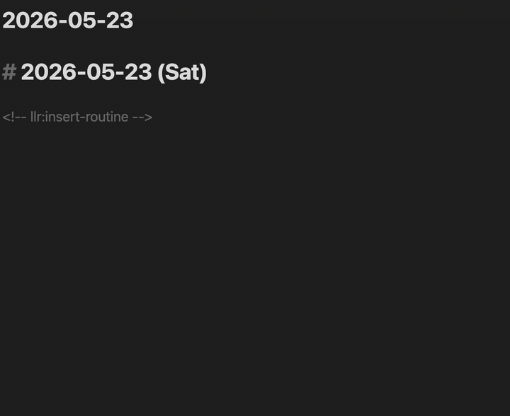

# LLR — Live Life Recording

[](https://github.com/goryugocast/llr/releases)
[](LICENSE)
[](https://obsidian.md/)

> **English site:** https://goryugo.com/en/llr/
> **日本語サイト:** https://goryugo.com/topics/llr

An Obsidian plugin that records **task start times, finish times, and daily flow directly in Markdown**. One command — `Toggle Task` — covers create, start, and finish. No external database, no lock-in. Uninstall anytime; your records stay as plain text.


---

## Why LLR?

There are many task plugins for Obsidian. LLR is different in four specific ways:

- **Markdown is the only source of truth.** Start / finish times, estimates, actuals all live in the task line itself. No sidecar JSON, no separate DB. You can `grep` your history.
- **One verb, three actions.** `Toggle Task` creates, starts, and finishes — no separate commands to remember. Long-press and Adjust-Time fill in the rest.
- **Routines as plain notes.** One note per routine under a `routine/` folder. Repeat patterns are written in human-readable shorthand (e.g. `every 3 days from completion` or `every week on mon`). Completion auto-advances `next_due`.
- **AI-friendly by design.** The full specification lives in [`docs/`](https://github.com/goryugocast/llr/tree/main/docs) as ~20 Markdown files. Point any AI at the folder and it can answer "how do I…?" without you reading manuals.

**Spend your attention on recording, not on learning the tool.**

---

## Install

### Community Plugins (recommended)

1. Open **Settings → Community Plugins → Browse**
2. Search for **"LLR"** and install
3. Enable LLR

### BRAT (latest beta)

1. Install and enable the **BRAT** community plugin
2. In BRAT settings, choose **Add Beta plugin** and enter `goryugocast/llr`
3. Enable LLR in community plugins

Requires Obsidian **1.7.2** or later.

---

## Quick Start

All you need to learn first is `Toggle Task`:

| Step | Action | Result |
|---|---|---|
| 1 | Run `Toggle Task` on an empty line | `- [ ] ` appears |
| 2 | Run `Toggle Task` again | `- [/] 09:00 - ` (start time inserted) |
| 3 | Run `Toggle Task` once more | `- [x] 09:00 - 09:28 (28m)` (elapsed time computed) |

That's it. The record is just a Markdown checkbox — edit timestamps by hand any time and LLR recalculates.

LLR avoids "fighting" normal editing. Auto-corrections only fire when **you** trigger them via commands or checkbox gestures, never on idle text changes.

See the [cheatsheet](https://github.com/goryugocast/llr/blob/main/docs/%E3%83%81%E3%83%BC%E3%83%88%E3%82%B7%E3%83%BC%E3%83%88.md) for a quick reference (includes a "what do I do when…?" reverse-lookup table).

---

## Features

### Task line grammar

| State | Format |
|---|---|
| Unstarted | `- [ ] HH:mm Task name (estimate)` |
| Running | `- [/] HH:mm Task name HH:mm - (estimate)` |
| Done | `- [x] HH:mm Task name HH:mm - HH:mm (est > actual)` |

Estimates accept `30`, `1.5h`, `45m`, `30 min` — written inline in parentheses or as a bare token at the end.

Inline markers (full reference: [recording format spec](https://github.com/goryugocast/llr/blob/main/docs/specs/%E8%A8%98%E9%8C%B2%E3%83%95%E3%82%A9%E3%83%BC%E3%83%9E%E3%83%83%E3%83%88.md)):

- `@done` — for routines with `start_before`, mark "this occurrence is already done" while the task is still in its pre-window.
- `@MMDD` / `@M/D` / `@2026-05-30` — reschedule a routine to a specific date.
- Processed markers normalize to `→done` / `→YYYY-MM-DD` so they're not re-fired.

### Commands (13 total)

The three you'll use most:

| Command | What it does |
|---|---|
| `Toggle Task` | Create → Start → Finish (the main verb) |
| `Adjust Time (1m)` | Smart 1-minute nudge: with one timestamp on the line, the start time moves back 1m; with two, the end time does. Completed lines recompute duration automatically. |
| `Open Summary View` | Show today's progress in the sidebar |

Auxiliary commands:

- `Start Task` / `Complete Task` / `Start Task (Align to Previous Completion)`
- `Reset Task (Keep Estimate)` / `Duplicate Task` / `Interrupt Task`
- `Skip Task (Log Only)` / `Retro Complete Task`
- `Reschedule Routine` / `Insert Routine`
- `Fix Duration Drift (All Completed Tasks)`

Full reference: [commands spec](https://github.com/goryugocast/llr/blob/main/docs/specs/%E3%82%B3%E3%83%9E%E3%83%B3%E3%83%89%E4%BB%95%E6%A7%98.md).

---

## Routines

Each note under a `routine/` folder is one routine. Define repeat behavior in the YAML frontmatter, then run `Insert Routine` to expand today's due routines into your daily note.

```yaml
---
estimate: 15            # minutes
section: 700            # groups under the 7:00 section header
repeat: every week on mon wed fri
next_due: 2026-05-25
start_before: 2         # show 2 days before next_due
---
```

A few `repeat` patterns:

- `1` / `3` — `every day` / `every 3 days`
- `every week on mon` / `every 2 weeks on mon wed fri` — weekly
- `every month on 1` / `every month on 5,10,15` / `every month on last day` — monthly by day
- `every month on 2nd sat` / `every month on last sat` — monthly by Nth weekday
- `every 3 days from completion` / `every 5 days from due` — choose the anchor
- `none` / `no` / `0` — stop

Japanese shorthand (`毎週月曜`, `毎月1日`, `第2土曜日`, etc.) is also accepted for users who prefer it.

Once a routine is completed, `next_due` updates automatically. The full "is this routine due today?" decision tree is in the [routine engine spec](https://github.com/goryugocast/llr/blob/main/docs/specs/%E3%83%AB%E3%83%BC%E3%83%81%E3%83%B3%E3%82%A8%E3%83%B3%E3%82%B8%E3%83%B3%E4%BB%95%E6%A7%98.md) §3.6.



---

## Summary View

Run `Open Summary View` for a sidebar overview of the day.


- Tasks stacked: completed → running → upcoming
- `EST. TOTAL` and `EST. FINISH` updated dynamically as the day progresses
- Tasks tagged `summary_role: sleep` are excluded from the main totals; a separate sleep-aware finish time is shown alongside
- Click a row to jump to that line in the editor; click a `[[wikilink]]` to open the linked note
- Section dividers driven by the `Routine Sections` setting (time + label pairs)

Details: [sidebar summary view spec](https://github.com/goryugocast/llr/blob/main/docs/specs/%E3%82%B5%E3%82%A4%E3%83%89%E3%83%90%E3%83%BC%E8%A6%81%E7%B4%84%E3%83%93%E3%83%A5%E3%83%BC%E4%BB%95%E6%A7%98.md).

---

## Mobile

Register `Toggle Task` in Obsidian's **Mobile Toolbar** (the icon row above the keyboard).

- **Short press** on a checkbox — Toggle Task (create / start / finish)
- **Long press** on a checkbox (~450 ms) — auxiliary actions (start aligned to the previous completion's end time, or revert one step while keeping the estimate)
- Haptic feedback included; long-press absorbs the subsequent click to avoid double-firing
- Enable `Large Mobile Checkboxes` in settings for a bigger tap target

<!-- TODO: assets/llr-mobile-longpress.gif — long-press gesture on mobile -->

---

## Status Bar

Shows three values:

- `total` — sum of today's task estimates
- `cursor` — sum from the cursor position onward
- `end` — current time + remaining estimates = projected finish time

Only end-of-line time tokens are counted, so numbers in the middle of text don't get accidentally aggregated.

---

## Not a goal

LLR aims to make "writing it down in Markdown" feel cheap and natural. The following are intentionally **out of scope**:

- ⛔ Timers, alarms, notifications (use the OS or another plugin)
- ⛔ Calendar integration
- ⛔ Statistics, charts, dashboards (the canonical record is Markdown; analyze it with separate tools)
- ⛔ Heavyweight dedicated views (the sidebar Summary is the cap)

The full "can it do X?" list is in [implementation summary §3](https://github.com/goryugocast/llr/blob/main/docs/specs/STATE_%E5%AE%9F%E8%A3%85%E7%8A%B6%E6%B3%81%E3%82%B5%E3%83%9E%E3%83%AA%E3%83%BC.md).

---

## Documentation

| Topic | Link |
|---|---|
| Index (start here) | [`docs/index.md`](https://github.com/goryugocast/llr/blob/main/docs/index.md) |
| Quick manual | [`docs/クイックマニュアル.md`](https://github.com/goryugocast/llr/blob/main/docs/%E3%82%AF%E3%82%A4%E3%83%83%E3%82%AF%E3%83%9E%E3%83%8B%E3%83%A5%E3%82%A2%E3%83%AB.md) |
| Cheatsheet (with reverse lookup) | [`docs/チートシート.md`](https://github.com/goryugocast/llr/blob/main/docs/%E3%83%81%E3%83%BC%E3%83%88%E3%82%B7%E3%83%BC%E3%83%88.md) |
| Current release notes | [`docs/specs/今回のバージョンについて.md`](https://github.com/goryugocast/llr/blob/main/docs/specs/%E4%BB%8A%E5%9B%9E%E3%81%AE%E3%83%90%E3%83%BC%E3%82%B8%E3%83%A7%E3%83%B3%E3%81%AB%E3%81%A4%E3%81%84%E3%81%A6.md) |
| Design philosophy | [`docs/specs/設計思想.md`](https://github.com/goryugocast/llr/blob/main/docs/specs/%E8%A8%AD%E8%A8%88%E6%80%9D%E6%83%B3.md) |
| Public site (EN) | https://goryugo.com/en/llr/ |
| Public site (JA) | https://goryugo.com/topics/llr |

The `docs/` folder is **structured to be fed to an AI assistant**. Drop it into a Cursor / Claude / ChatGPT project to ask questions about behavior. Most spec files are written in Japanese, but AI tools translate transparently on the fly.

---

## Development

```bash
npm install
npm run dev          # watch build
npm run build        # production bundle (main.js)
npm run build:sync   # bundle + sync to a local Obsidian vault
npm run lint         # eslint
npm test             # vitest (watch)
npx vitest run       # vitest (one-shot)
```

To cut a release, push a semver tag (e.g. `0.2.0`). The `.github/workflows/release.yml` workflow builds, runs lint and tests, attests the artifacts, and creates a GitHub Release automatically.

## Issues / Feedback

- Bug reports and feature requests: [GitHub Issues](https://github.com/goryugocast/llr/issues)
- Requests that fall under "Not a goal" above may be politely declined.

## License

[MIT](LICENSE)
