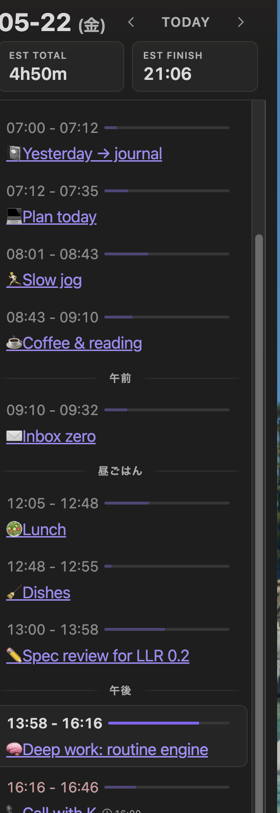

# LLR — Live Life Recording

> **日本語ドキュメント:** https://goryugo.com/topics/llr

An Obsidian plugin for recording task start times, finish times, and daily flow directly in Markdown. One command — `Toggle Task` — creates, starts, and finishes a task. No complex UI. No lock-in. Just Markdown checkboxes.

Uninstall the plugin anytime — your data stays as plain text.

## Ask AI, not the manual

You only need to learn one command: `Toggle Task`. For everything else, ask AI.

LLR's full specification lives in this repository's [`docs/`](https://github.com/goryugocast/llr/tree/main/docs) folder. Tell any AI assistant to read it, and it can explain commands, walk you through workflows, and answer questions — so you don't have to memorize 13 commands yourself.

**Spend your attention on recording, not on learning the tool.**

## Install (BRAT)

1. Install and enable the **BRAT** community plugin
2. In BRAT settings, choose **Add Beta plugin** and enter `goryugocast/llr`
3. Enable LLR in community plugins

## Quick Start

All you need is `Toggle Task`:

1. **Create** — run `Toggle Task` on an empty line → `- [ ]` appears
2. **Start** — run `Toggle Task` again → current time is inserted, status becomes `- [/]`
3. **Finish** — run `Toggle Task` once more → status becomes `- [x]` with elapsed time


Records are Markdown checkboxes. Edit the timestamps by hand anytime — LLR recalculates automatically.

LLR tries not to "fight" normal Markdown editing. Broad auto-correction is avoided; consistency fixes are mainly attached to explicit LLR actions such as commands and checkbox gestures.

## Main Commands

| Command | What it does |
|---|---|
| Toggle Task | Create → Start → Finish a task |
| Skip Task (Log Only) | Mark a task as skipped |
| Open Summary View | Show daily progress in the sidebar |

These three cover everyday use. LLR has 13 commands total — see the [full documentation](https://goryugo.com/en/llr/) for details.

## Task States

| State | Format |
|---|---|
| Unstarted | `- [ ] Task name (estimate)` |
| Running | `- [/] HH:mm - Task name` |
| Done | `- [x] HH:mm - HH:mm (actual) Task name` |

## Mobile

Register `Toggle Task` in Obsidian's **Mobile Toolbar** (the icon row above the keyboard):

- **Short press** — Toggle Task (create / start / finish)
- **Long press** — Auxiliary actions (align to previous completion, reset, etc.)

## Summary View

Open the summary sidebar to see running tasks, remaining estimates, and daily totals at a glance.



## Documentation

- **English:** https://goryugo.com/en/llr/
- **日本語:** https://goryugo.com/topics/llr
- **For AI assistants:** [`docs/`](https://github.com/goryugocast/llr/tree/main/docs) in this repository
- **Design principle:** see [`docs/specs/設計思想.md`](https://github.com/goryugocast/llr/blob/main/docs/specs/%E8%A8%AD%E8%A8%88%E6%80%9D%E6%83%B3.md) and [`docs/specs/UI操作仕様.md`](https://github.com/goryugocast/llr/blob/main/docs/specs/UI%E6%93%8D%E4%BD%9C%E4%BB%95%E6%A7%98.md)

## Development

```bash
npm install
npm run dev        # watch build
npm run build      # production bundle
npm run build:sync # bundle + sync to local Obsidian vault
npm run test       # run tests
```

## License

MIT
